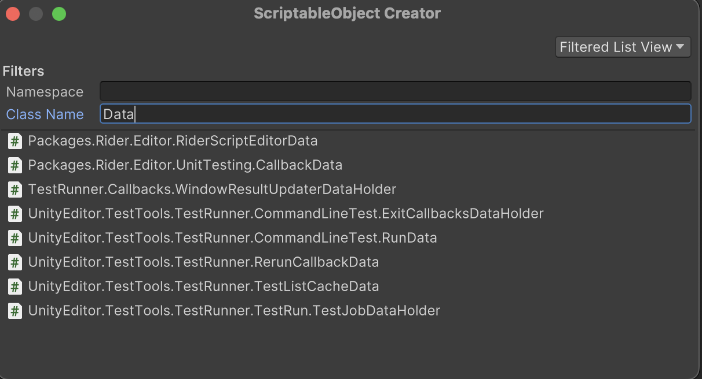

# ScriptableObjectCreator

3 Unity editor tools that make it easier to create ScriptableObjects.

## What problem is this solving?

Using ScriptableObject assets is common in Unity development. However, creating them requires some boilerplate code:

```csharp
[CreateAssetMenu(fileName = "SoundEffect", menuName = "MyCompany/Audio/SoundEffect")]
public class SoundEffect : ScriptableObject
{
   public AudioClip clip;
   public float volume;
}
```

It might seem like one line of code wouldn't hurt much, but it can be surprisingly difficult to come up with
a menu structure which allows users to quickly find the assets they need in large projects.

It can also be tedious to remember using the attribute and following the existing menu structure, not to mention
the pain of defining a sorting order for these items.

## Features

All of these problems are addressed by the following tools.

### 1)  Wizard


Select `Create > ScriptableObject... (Creator)` from the Unity _Assets_ menu or
by context-clicking in the _Project_ window.

The editor window displays a searchable list of all ScriptableObject types in the project.
This makes finding a specific asset type much easier than navigating through a fixed menu structure.

- Only types that can be used to create ScriptableObject assets are shown.
- Results can be filtered by:
    - Namespace
    - Class name
- 3 view modes can be used:
    - Flat list
    - List grouped with a foldout for each namespace root
    - Tree view to browse all types
- User preferences:
    - Default namespace filter
    - Close the window after creating an asset
    - The current view mode is saved between sessions




When clicking on a type, a new asset is created in the active project view folder and name editing is started.
By cancelling the name editing, the asset is deleted.
By confirming the name editing, the asset is saved. Undo is not supported in this case.

### 2) Contextual Property Menu


All object reference fields in the inspector receive a context menu item
that creates a new instance of the ScriptableObject type.

The reference is assigned to the field after creation. Undo is supported.

The instance can either be saved:

1. As part of the scene. Using undo or removing the reference will remove the instance from the scene (without leaking).
2. As an asset in the project. Undo is not possible, but the operation can be cancelled when selecting a save path.

All serialized field configurations are supported, e.g.:

- public
- private with [SerializeField]
- nested types
- arrays and lists

### 3) MonoScript Context Menu


The context menu of a ScriptableObject script file receives a context menu which allows creating a new asset of the
script type. To use this feature:

1. Select the _MonoScript_ asset in the _Project_ window.
2. In the _Inspector_ window, navigate to the _Imported Object> section
   (the second header that says _ScriptName (Mono Script)_.
3. Context-click this header are or use the burger menu.

## Support

Unity 2021.3 or newer.
